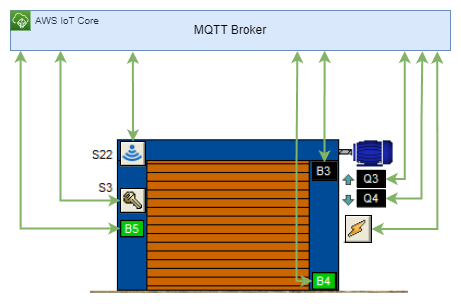

<p id="readme-top" align="center">
  
  <h1  align="center">Smart Factory</h1>
</p>

The Smart Factory is an IoT project, which we realized in the IoT Frameworks lecture as part of our master’s degree in Cloud Computer Engineering at the Burgenland University of Applied Sciences.

## Table of Contents

- [Motivation](#motivation)
- [Architectur](#architectur)
- [Built with](#builtwith)
- [Run the simulator](#runthesimulator)

## Motivation <a name="motivation"></a>

In the smart factory there are numerous plants that are operated by various IoT Devices. These IoT devices are managed and controlled using the AWS IoT Framework IoT Core. In order to illustrate the functions of this framework, the following 3 systems were simulated in the demonstrator and controlled via IoT Core:

<p align="center">
  
</p>

<p align="right">(<a href="#readme-top">back to top</a>)</p>

## Architectur <a name="architectur"></a>

The Smart Factory consists of 2 parts. The visualization is done in a desktop application that was implemented using the Windows Presentation Foundation. When implementing this simulator, care was taken to ensure that each activator only sends messages to AWS IoT Core, but does not trigger any local action itself. The factory gate, the elevator or the hydraulic press are soly controlled by commands, which are received from AWS IoT Core.

<p align="center">
  
</p>

The picture above shows an example of the information flow between the simulated sensors and AWS IoT Core. Each sensor acts independently on the received messages and updates its status. The Message Queuing Telemetry Transport Protocol, MQTT for short, is used for communication between the individual components. The following topics were defined for controlling the individual factory systems:

* mcce22-smart-factory/door
* mcce22-smart-factory/lifter
* mcce22-smart-factory/press

In the simulator, the 3 systems can be controlled and each sensor simulates its action status changes. The communication between the individual sensor instances takes place exclusively via AWS IoT Core by exchanging messages. These messages contain the current status of the IoT device. Other sensors or IoT devices can then react to these status changes if they need to.

<p align="center">
  
</p>

<p align="right">(<a href="#readme-top">back to top</a>)</p>

## Built with <a name="builtwith"></a>

- [Visual Studio](https://visualstudio.microsoft.com/de/vs/community/)
- [Net Core](https://dotnet.microsoft.com/)
- [Windows Presentation Foundation](https://learn.microsoft.com/en-us/dotnet/desktop/wpf/overview/)
- [AWS IoT Core](https://aws.amazon.com/de/iot-core/)
- [MahApps.Metro](https://mahapps.com/)
- [Castle Windsor](http://www.castleproject.org/)
- [MQTTnet](https://github.com/dotnet/MQTTnet)

<p align="right">(<a href="#readme-top">back to top</a>)</p>

## Run the simulator <a name="runthesimulator"></a>

1. Sign in to the AWS console
2. Navigate to the IoT Core service
3. Select ```Connect > Connect one device``` in the side navigation
4. Scroll to "Prepare your device" in the content area and select and save the ```Data Plane Endpoint``` Address. This address has the format {identifier}-ats.iot.{region}.amazonaws.com
5. In the side navigation, select ```Manage > Security > Policies```
6. Create a new policy. Here is an example of a policy that allows all actions for all resources:
```
{
  "Version": "2012-10-17",
  "Statement": [
    {
      "Effect": "Allow",
      "Action": "iot:*",
      "Resource": "*"
    }
  ]
}
```
7. In the side navigation, select ```Manage > All devices > Things```
8. Create a new thing (name doesn't matter). Select the ```previously created policy``` from step 6 and keep all other default values. Download the certificatesat the end of the creation wizard. The following files are required by the simulator:
* Device certificate
* Private key file
* Amazon Root CA certificate
9. Clone the repository
10. Copy the certificate to the ```Certificates``` folder and use the following names:
* Device certificate: ```certificate.pem.crt```
* Private Key File: ```private.pem.key```
* Amazon Root CA certificate: ```AmazonRootCA1.pem```
11. Open the project/solution with ```Visual Studio``` or ```VSCode```.
12. Open the configuration file ```appsettings.json``` and use the ```Data Plane Endpoint``` Address from step 4 as ```EndpointAddress```. The other settings can be left as they are.
13. Start the application (Ctrl+F5 or Debug > Start without debugging)

<p align="right">(<a href="#readme-top">back to top</a>)</p>